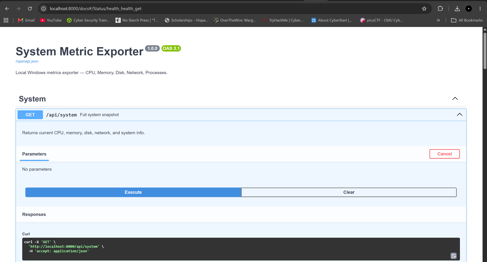
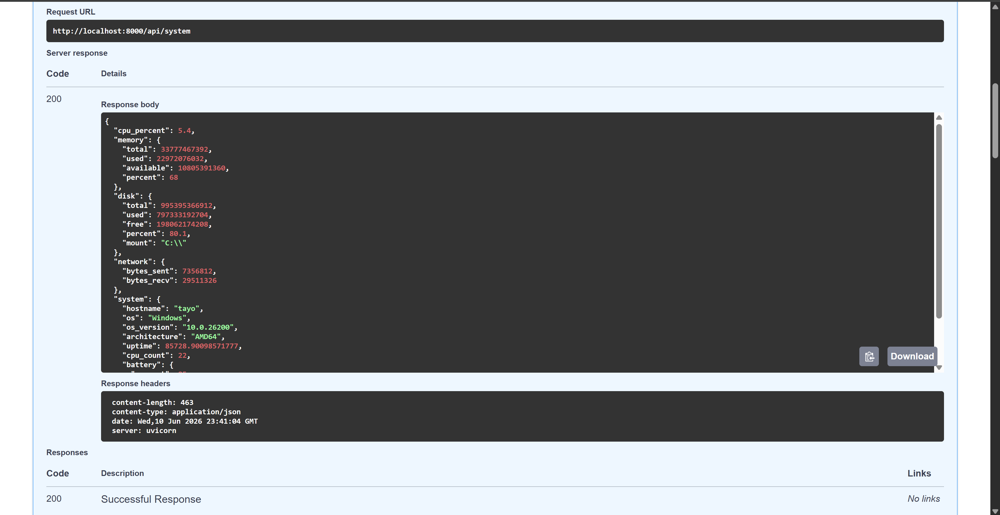
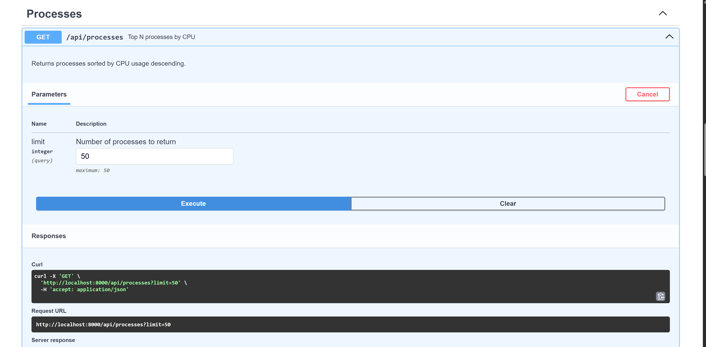
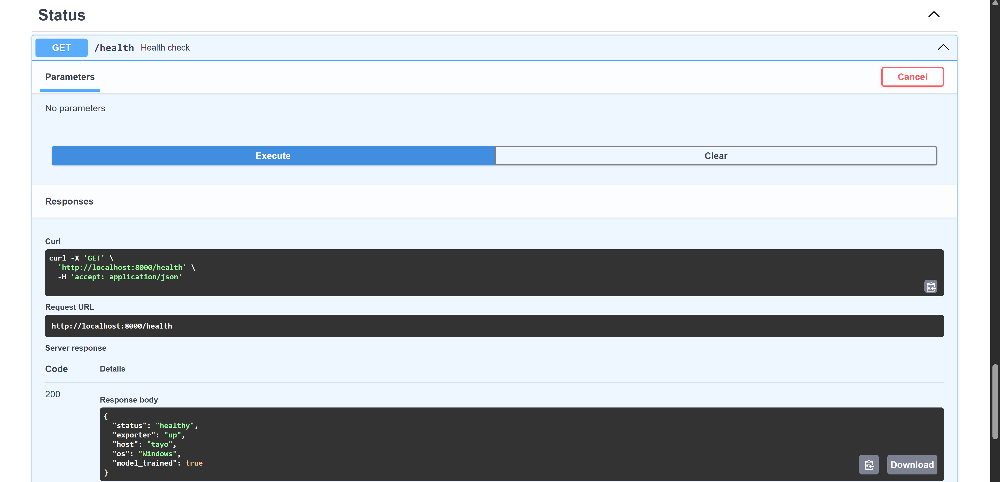
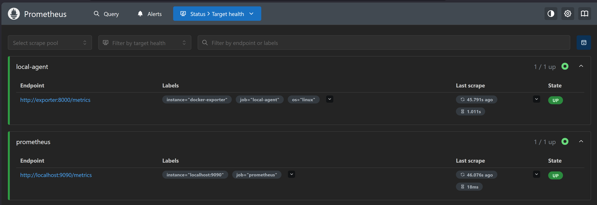
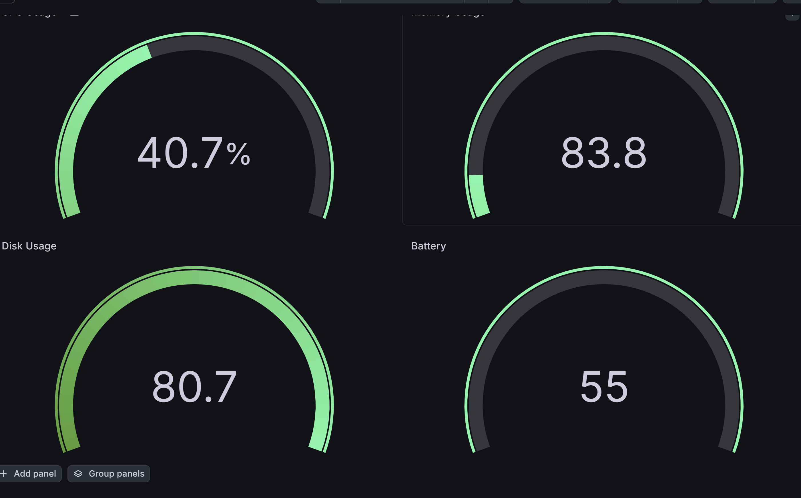
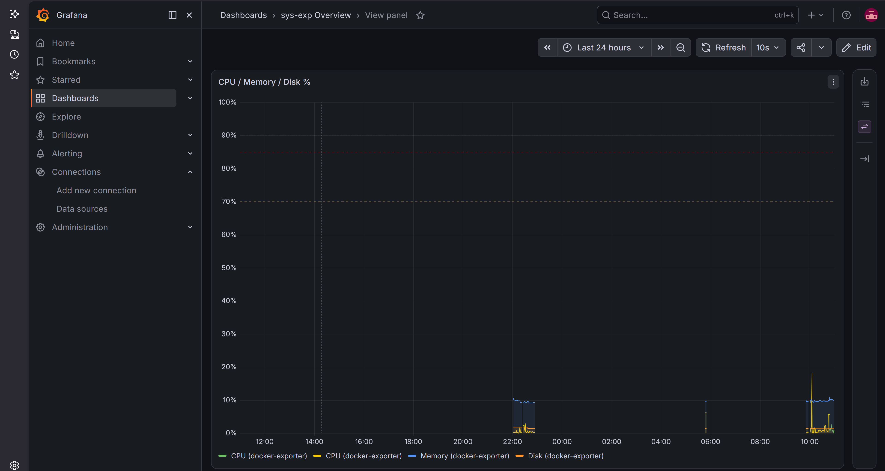
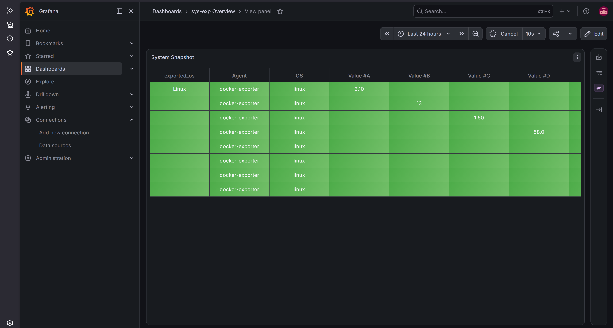

# System Information Exporter

## Project Overview

This project demonstrates a complete system monitoring platform for collecting, visualizing, and analyzing system metrics from a single device. It leverages Prometheus for metrics collection, Python agents to expose system stats via HTTP, and optionally uses Tailscale VPN for secure cross-device monitoring.

The application showcases modern DevOps and monitoring practices, including system metric collection, container-friendly design, and secure private network integration.


---

## Goals & Objectives

### Primary Goals

* Build a functional system monitoring platform across multiple laptops.
* Collect metrics including CPU, memory, disk, network, and process usage.
* Deploy Prometheus to scrape metrics from distributed agents.
* Ensure data privacy using localhost and/or Tailscale VPN connections.
* Export and gather metrics through customized visualizations in Grafana dashboards.

### Learning Objectives

* Gain hands-on experience with Prometheus and Python metric exporters.
* Understand monitoring agent design and metric exposure with Flask.
* Learn how to securely collect metrics across devices without exposing sensitive IP addresses.
* Explore DevOps workflows for system observability.

---

## Tools & Technologies Used

### Development

* Python: Programming language for building the monitoring agents.
* FastAPI: Web framework used to expose system metrics and REST endpoints via HTTP, with built-in interactive Swagger UI docs at `/docs`.
* Command Prompt (CMD): Windows terminal used for running Python scripts, Prometheus, and system commands.

### Monitoring & Observability

* Prometheus: Open-source monitoring system for collecting and storing time-series metrics.
* Prometheus Python Client: Python library to expose system metrics in Prometheus-compatible format.
* Grafana: Dashboard for visualizing metrics in real-time.

### Networking & Security

* localhost: Localhost metric endpoints for agent testing and privacy.

DevOps Practices

* YAML: Configuration language for Prometheus scrape configs.
* Infrastructure as Code (IaC): Declarative configuration of Prometheus targets and agent labels.
* Docker & Docker Compose: Containerizes the exporter and runs the full monitoring stack (exporter, Prometheus, Alertmanager, Grafana) with one command.

---

## Project Structure

| File                    | Purpose |
|--------------------------|---------|
| `main.py`                 | FastAPI app — the exporter agent. Defines `/metrics`, `/api/*` endpoints, and Prometheus gauges. |
| `metrics.py`               | Cross-platform system metric collection (CPU, memory, disk, network, processes, GPU) via psutil/GPUtil. |
| `net_observer.py`          | `IsolationForest`-based anomaly detector used by `main.py`. |
| `prometheus.yml`           | Prometheus config for running natively on the host — scrapes the exporter at `localhost:8000`. |
| `docker/prometheus.yml`    | Prometheus config for the Docker Compose stack — scrapes the exporter at `exporter:8000` (containers address each other by service name, not `localhost`). These two files intentionally differ only in target hostnames; both are needed, one per run mode. |
| `alert_rules.yml`          | Prometheus alerting rules (CPU/memory/disk thresholds, exporter down, anomaly detection). Shared by both `prometheus.yml` variants. |
| `alertmanager.yml`         | Reference Alertmanager config for routing fired alerts (email/Slack/webhook). |
| `Dockerfile`               | Builds the exporter into a standalone image. |
| `docker-compose.yml`       | Brings up exporter + Prometheus + Alertmanager + Grafana together. |
| `requirements.txt`         | Python dependencies. |

---
## FastAPI, Prometheus, and Grafana specs










## Key Takeaways

### Technical Skills Developed

* A single device monitoring with Prometheus.
* Python-based system metric collection and API design.
* Prometheus configuration for multiple targets and labels.

### Challenges

* Ensuring metrics collection across laptops without exposing sensitive network information.
* Configuring Prometheus to scrape multiple agents on different devices.
* Handling multiple ports and secure agent connections using Tailscale.

---

## Running with Docker

The whole stack — exporter, Prometheus, Alertmanager, and Grafana — runs
with a single command via `docker-compose.yml`:

```
docker compose up --build
```

| Service      | URL                              |
|--------------|-----------------------------------|
| Exporter API | http://localhost:8000/docs        |
| Prometheus   | http://localhost:9090             |
| Alertmanager | http://localhost:9093             |
| Grafana      | http://localhost:3000 (admin/admin) |

The exporter's `Dockerfile` builds a standalone image (`docker compose build
exporter` or `docker build -t sys-exp .`) that can also run on its own:

```
docker run -p 8000:8000 sys-exp
```

Inside the compose network, containers reach each other by service name, so
Prometheus is configured to scrape `exporter:8000` and alert to
`alertmanager:9093` via `docker/prometheus.yml` — a container-networking
variant of the root `prometheus.yml`, which still targets `localhost` for
running services directly on the host without Docker.

Tear down with `docker compose down` (add `-v` to also drop the Prometheus
and Grafana data volumes).

## Alerting

`alert_rules.yml` defines Prometheus alerting rules for CPU, memory, and disk
thresholds, exporter downtime, and anomalous behavior (see below). Prometheus
is configured (`prometheus.yml`) to evaluate these rules and send firing
alerts to Alertmanager on `localhost:9093`. Rules evaluate and appear under
Prometheus's `/alerts` page even without Alertmanager running — Alertmanager
is only needed if you want alerts routed somewhere (email, Slack, a webhook).
A reference config is provided in `alertmanager.yml`; fill in a real receiver
and run `alertmanager --config.file=alertmanager.yml` alongside Prometheus.

## GPU & Process Metrics

* GPU load, memory used/total, and temperature are exposed per-GPU via
  `/api/gpu` and the `system_gpu_*` Prometheus gauges, using
  [GPUtil](https://github.com/anderskm/gputil) (NVIDIA GPUs only). On
  machines without a supported GPU or without GPUtil installed, this
  degrades gracefully to an empty list rather than erroring.
* `/api/processes` now also returns each process's RSS memory, thread count,
  and status, in addition to CPU/memory percent.

## Anomaly Detection

The `IsolationForest`-based `NetworkObserver` (`net_observer.py`) trains
online on CPU/memory/network samples collected during Prometheus scrapes.
Once at least 50 samples have been observed, `/api/anomaly` and the
`system_anomaly_detected` gauge report whether the current sample looks
anomalous relative to the model. The `AnomalousSystemBehavior` alert in
`alert_rules.yml` fires off that gauge like any other threshold alert.

## Cross-Platform Support

The exporter runs on Windows, Linux, and macOS. Disk usage resolves the
system drive root per-OS (`C:\` on Windows, `/` on Linux/macOS) instead of
hardcoding a Windows path, and the reported hostname comes from
`socket.gethostname()` rather than a fixed string.

## Long-Term Metric Storage

By default Prometheus only retains samples locally for its configured
retention window. To keep history for long-term trend analysis, uncomment
the `remote_write` block in `prometheus.yml` and point it at a
remote-write-compatible backend such as
[VictoriaMetrics](https://victoriametrics.com/) (single-node is a one-line
Docker run) or Thanos Receive.

## Multi-Device / Distributed Monitoring

Prometheus aggregates metrics from multiple laptops by scraping multiple
targets under the same job — this is the mechanism behind the "multiple
laptops" goal above, no extra component needed. Run `python main.py --port
<port>` on each machine (optionally reachable over Tailscale for privacy),
then add one `static_configs` entry per machine to the `local-agent` job in
`prometheus.yml`; a commented example is included there.

---

## Future Enhancements

### Recently Implemented

* ✅ Prometheus alerting rules for CPU, memory, and disk thresholds.
* ✅ GPU and process-level metrics.
* ✅ Anomaly detection wired up to a metric/endpoint/alert.
* ✅ Multi-platform (Windows/Linux/macOS) agent support.
* ✅ Long-term metric storage via optional remote_write.
* ✅ Documented multi-device aggregation via Prometheus multi-target scraping.
* ✅ Dockerfile + Docker Compose stack (exporter, Prometheus, Alertmanager, Grafana).

### Remaining Medium-Term Work

* Dynamic agent discovery and auto-registration in Prometheus (currently
  targets are added manually to `prometheus.yml`; Prometheus supports file-
  or DNS-based service discovery for this).
* Horizontal Pod Autoscaler (HPA) integration if deployed in Kubernetes —
  not attempted here since it requires an actual cluster to build and test
  against.

### Remaining Long-Term Goals

* True distributed aggregation beyond Prometheus's built-in multi-target
  scraping (e.g. Thanos/Cortex-style global query view across multiple
  independent Prometheus instances), if the project ever needs more than a
  handful of devices.
* Persisting the trained IsolationForest model to disk (so it survives
  restarts) and retraining it on a rolling window instead of only once at
  50 samples.
